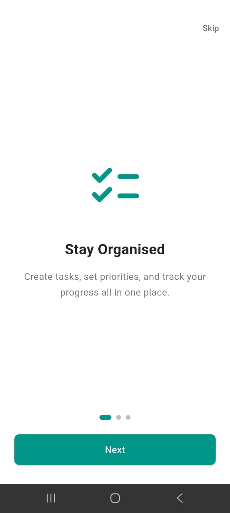
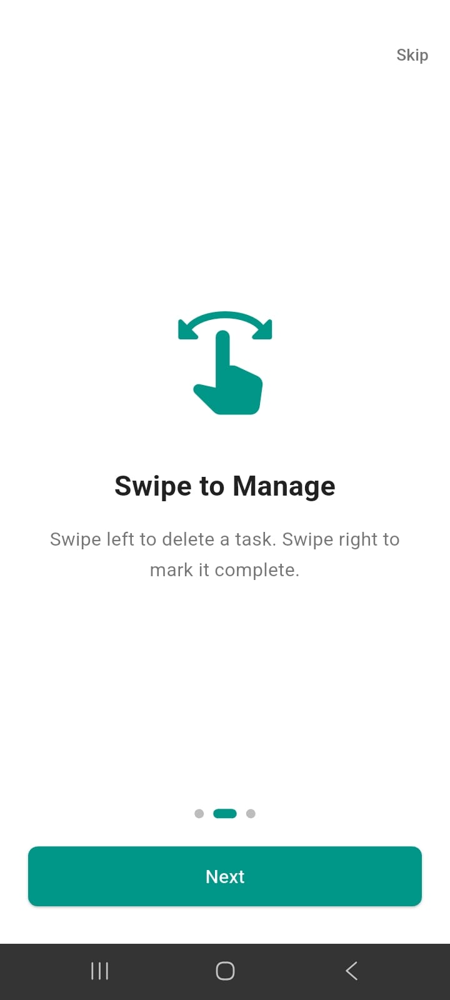
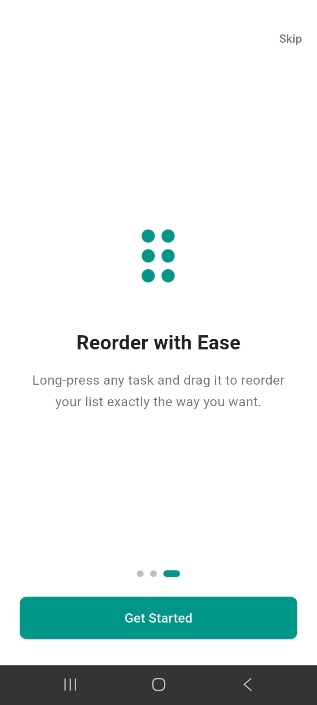
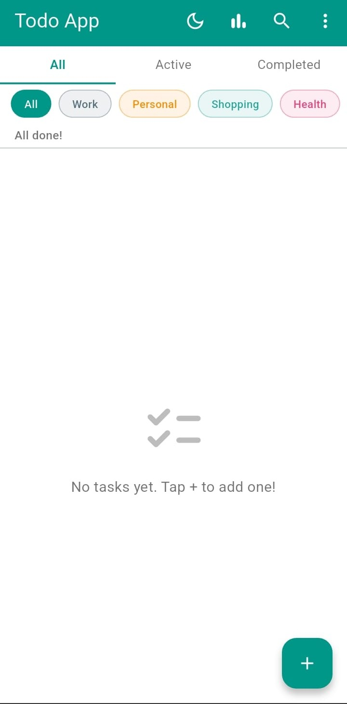
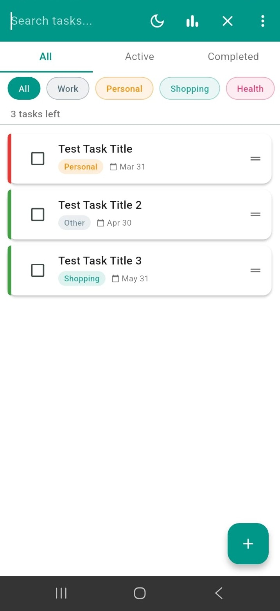
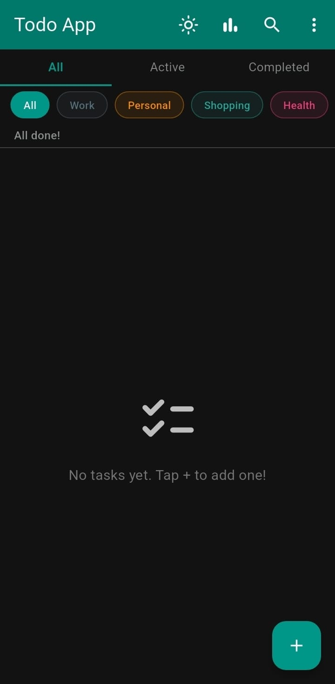
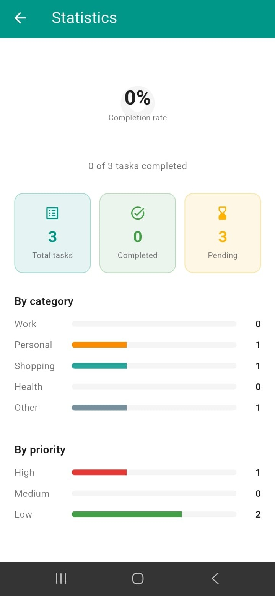

# TODO App

A clean, feature-rich task management application built with Flutter for Android. The app runs entirely on-device with no internet connection or backend required — all data is stored locally using Hive. Built as a portfolio project to demonstrate mobile development skills with Flutter and Dart.

---

## Screenshots

| | | |
|---|---|---|
|  |  |  |
| Onboarding — screen 1 | Onboarding — screen 2 | Onboarding — screen 3 |
|  |  |  |
| Home screen — light mode (empty state) | Home screen with tasks | Home screen — dark mode |
|  | | |
| Statistics screen | | |

---

## Features

- Create, edit, and delete tasks with a title, description, priority, category, and due date
- Three filter tabs: All, Active, and Completed
- Real-time keyword search across task titles and descriptions
- Filter tasks by category: Work, Personal, Shopping, Health, Other
- Sort tasks by priority: High, Medium, Low
- Swipe left on a task to delete it
- Swipe right on a task to toggle its completion state
- Long-press and drag to manually reorder tasks — order is saved across app restarts
- Undo delete via a SnackBar that appears for 5 seconds after deletion
- Bulk actions: toggle all tasks complete or incomplete, clear all completed tasks
- Task priority indicator shown as a colored left border on each task card
- Overdue warning shown in red when a task's due date has passed
- Optional subtasks with a linear progress indicator showing how many are complete
- Task creation timestamp displayed as a relative time ("Created 3 days ago")
- Local push notifications scheduled for 9 AM on each task's due date
- Dark mode with theme preference saved between sessions
- Statistics screen showing total, completed, and pending task counts by category and priority
- Onboarding flow shown on first launch explaining core gestures
- Smooth entrance animations when tasks appear in the list
- Accessibility support with Semantics wrappers on interactive elements

---

## Tech Stack

| Layer | Technology |
|---|---|
| Framework | Flutter (Dart) |
| State Management | Riverpod |
| Local Storage | Hive + hive_flutter |
| Simple Preferences | shared_preferences |
| Notifications | flutter_local_notifications |
| Relative Timestamps | timeago |
| Date Formatting | intl |
| Build Target | Android (release APK) |

No backend, no database server, no API calls. All data lives entirely on the device.

---

## Download and Install

### Option 1 — Download from GitHub Releases (Recommended)

1. Go to the [Releases page](https://github.com/Martin888Maina/todo-app/releases) of this repository
2. Under the latest release, download `app-release.apk`
3. Transfer the APK to your Android phone (via email, Google Drive, or USB cable)
4. On your phone, open the APK file using your file manager
5. If prompted, tap "Allow from this source" to permit installation from unknown sources
6. The app will install and appear in your app drawer
7. No account creation or internet connection is required — the app works fully offline

### Option 2 — Download Directly from the Repository

1. Navigate to the `/release` folder in this repository
2. Click on `app-release.apk`
3. Click "Download raw file"
4. Follow steps 3 through 7 above

---

## Run Locally

To build and run the app from source, you need Flutter installed on your machine.

```
git clone https://github.com/Martin888Maina/todo-app.git
cd todo-app/todo_app
flutter pub get
flutter run
```

To generate the Hive TypeAdapters after making model changes:

```
dart run build_runner build --delete-conflicting-outputs
```

To build the release APK:

```
flutter build apk --release
```

The APK will be output to `build/app/outputs/flutter-apk/app-release.apk`.

---

## Project Structure

```
todo_app/
├── android/                    # Android platform files
├── lib/
│   ├── models/                 # Task data model with Hive TypeAdapter
│   │   └── task.dart
│   ├── screens/                # Full-page screens
│   │   ├── home_screen.dart
│   │   ├── task_detail_screen.dart
│   │   ├── statistics_screen.dart
│   │   └── onboarding_screen.dart
│   ├── widgets/                # Reusable UI components
│   │   ├── task_tile.dart
│   │   ├── task_form.dart
│   │   ├── filter_tabs.dart
│   │   ├── category_chip.dart
│   │   └── empty_state.dart
│   ├── providers/              # Riverpod state management
│   │   ├── task_provider.dart
│   │   ├── filter_provider.dart
│   │   └── theme_provider.dart
│   ├── services/               # Local storage and notification setup
│   │   ├── hive_service.dart
│   │   └── notification_service.dart
│   ├── utils/                  # Constants and helpers
│   │   ├── app_colors.dart
│   │   ├── app_strings.dart
│   │   └── date_helpers.dart
│   └── main.dart               # App entry point
├── release/                    # Release APK for direct download
│   └── app-release.apk
├── screenshots/                # App screenshots
├── .gitignore
├── pubspec.yaml
├── README.md
└── LICENSE
```

---

## License

This project is licensed under the MIT License. See the [LICENSE](LICENSE) file for details.
